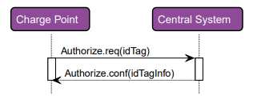
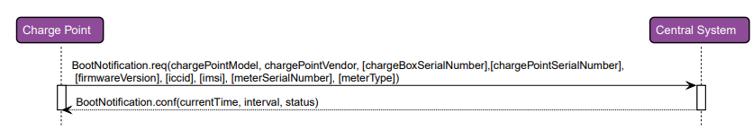
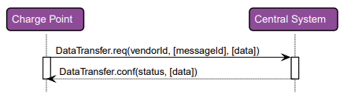
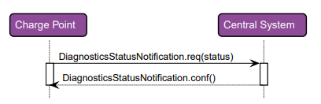
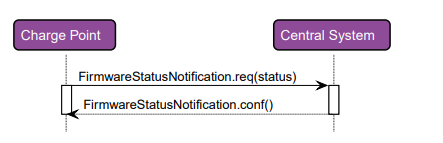
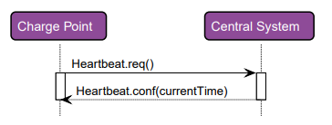
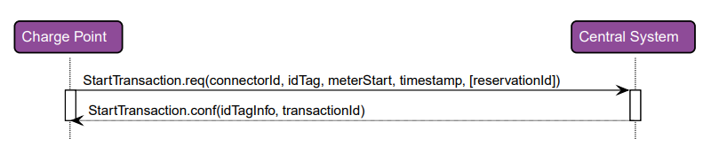
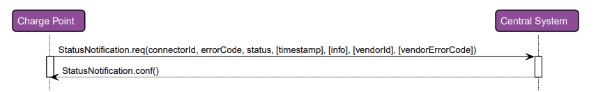
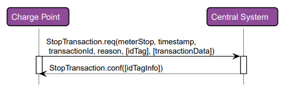

# SpringOcppTeste
# Implementando um teste para comunicação com estação de recarga usando o OCPP

O intuito desse projeto é aprender a operar e entender o como funciona o OCPP. Por enquanto o único público alvo desse trabalho é o próprio autor.

##Breve resumo sobre o OCPP
O OCPP é um protocolo desenvolvido pela Open Charge Alliance. O OCPP é um protocolo de aplicação
de comunicação entre estações de recarga, veículos elétricos e a central de de gerenciamento. Um dos pontos importantes 
do projeto é tornar essa interação fácil e livre
sendo possível ser utilizada em qualquer estação de recarga.

##Implementações feitas nesse projeto:
BootNotification;
Heartbeat;
StatusNotification;
StartTransaction;

## Operações iniciadas pela estação de carga:

### Authorize

### Boot Notification

### Data Transfer

### Diagnostics Status Notification

### Firmaware Status

### Heartbeat

### Start Transaction

### Status Notification

### Stop Transaction

### Exemplo de requisição BootNotification feita pela estação de recarga:

<pre> 
[2,
 "19223201",
 "BootNotification",
 {"chargePointVendor": "VendorX", "chargePointModel": "SingleSocketCharger"}
]
</pre> 

### Exemplo de resposta BootNotification feita pelo servidor:

<pre> 
[3,
 "19223201",
 {"status":"Accepted", "currentTime":"2013-02-01T20:53:32.486Z", "heartbeatInterval":300}
]
</pre> 

