# SpringOcppTeste
# Implementando um teste para comunicação com estação de recarga usando o o protocolo OCPP

O intuito desse projeto é aprender a operar e entender o como funciona o OCPP. Por enquanto o único público alvo desse trabalho é o próprio autor.

##Breve resumo sobre o OCPP
O OCPP é um protocolo desenvolvido pela Open Charge Alliance. O OCPP é um protocolo de aplicação
de comunicação entre estações de recarga, veículos elétricos e a central de de gerenciamento. Um dos pontos importantes 
do projeto é tornar essa interação fácil e livre
sendo possível ser utilizada em qualquer estação de recarga.

##Implementações feitas nesse projeto:
BootNotification;
Heartbeat;
StatusNotification;
StartTransaction;

## Operações iniciadas pela estação de carga:

### Authorize

Antes que o dono do veículo possa iniciar a recarga, a estação precisa autorizar a operação.

### Boot Notification

Após a estação inicializar é feita uma requisição a central com os seus dados de configuração. A estação aguarda a resposta em status "Accepted" para prosseguir com a operação.
Toda vez que o sistema inicializa ou reinicializa essa operação é feita.

### Data Transfer

Quando a estação precisa mandar informações para central com funções não suportadas pelo OCPP utiliza-se o DataTransfer.

### Diagnostics Status Notification

A estação envia notificações sobre o status de diagnostico de envio.

### Firmaware Status

### Heartbeat

Para que a central saiba que a estação de recarga continua conectada, o ponto de recarga envia uma notificação Heartbeat a um dado intervalo de tempo.

### Start Transaction

O ponto de recarga envia uma notificação StartTransaction para a central para informar que a operação de carga foi iniciada.

### Status Notification

A estação de recarga envia uma notificação para a central para informar sobre mudanças de status ou possiveis erros que acontecem com a estação.

### Stop Transaction

Quando uma operação termina ou é parada, a estação envia uma notificação do tipo StopTransaction informando que a transação foi finalizada.

## Operações iniciadas pela Central:

### Cancel Reservation
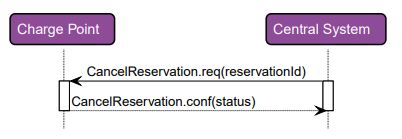

### Change Availability
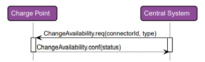

### Change Configuration
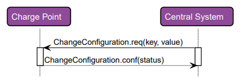

### Clear Cache
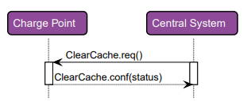

### Clear Chargin Profile

### Data Transfer
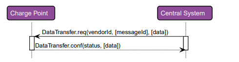

### Get Composite Schedule
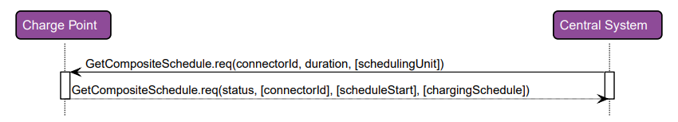

### Get Configuration
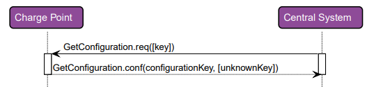

### Get Diagnostics
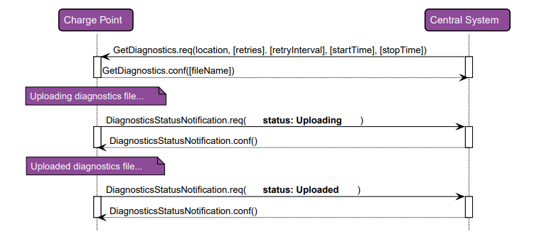

### Get Local List Version
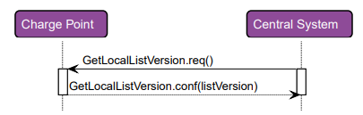

### Remote Start Transaction
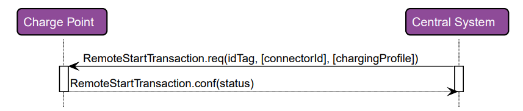

### Remote Stop Transaction
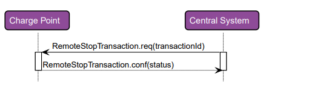

### Reserve Now
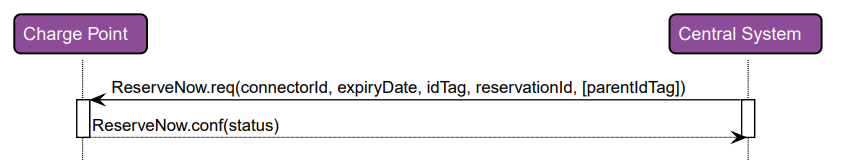

### Reset
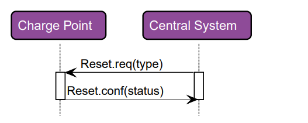

### Send Local List
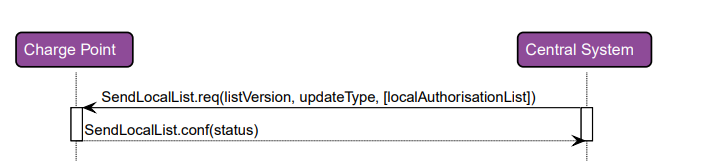

### Set Charging Profile
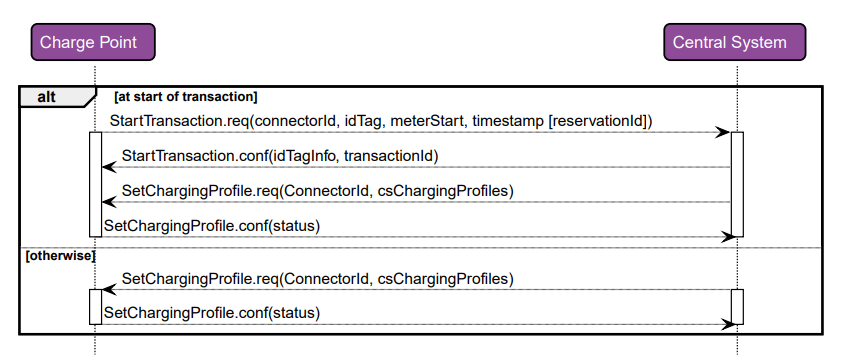

### Trigger Message
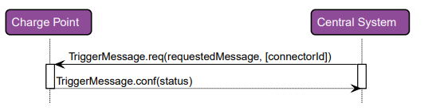

### Unlock Connector
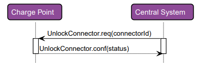

### Update Firmware
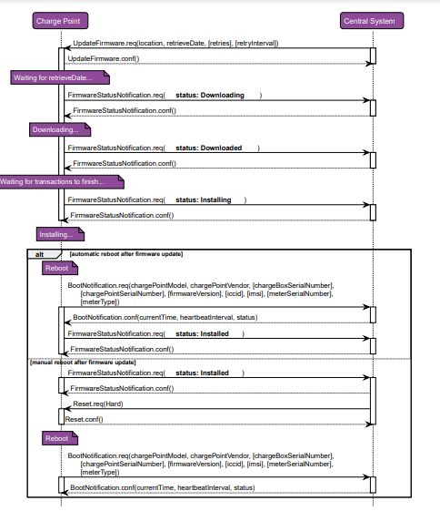

### Exemplo de requisição BootNotification feita pela estação de recarga:

<pre> 
[2,
 "19223201",
 "BootNotification",
 {"chargePointVendor": "VendorX", "chargePointModel": "SingleSocketCharger"}
]
</pre> 

### Exemplo de resposta BootNotification feita pelo servidor:

<pre> 
[3,
 "19223201",
 {"status":"Accepted", "currentTime":"2013-02-01T20:53:32.486Z", "heartbeatInterval":300}
]
</pre> 

